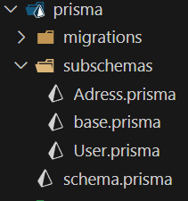
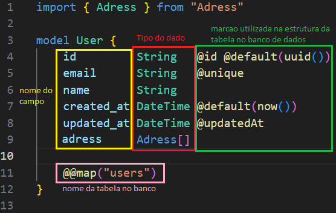
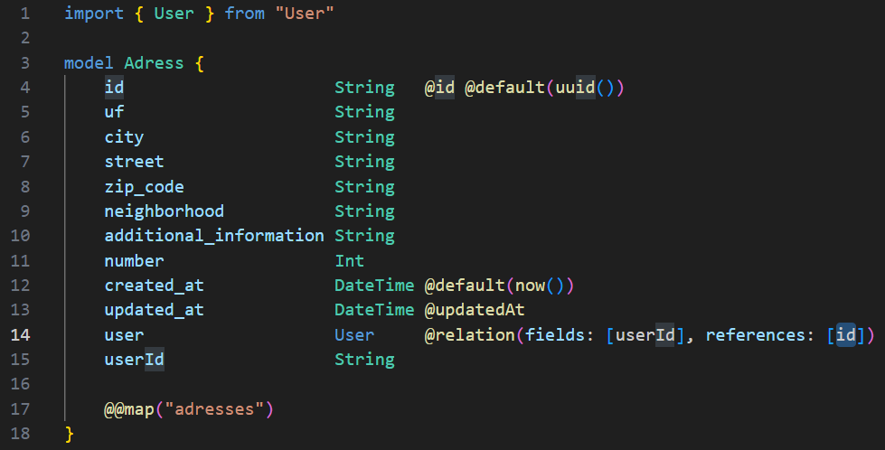

#  Uniao Estacio

## Objetivo

permitir que estudantes ganhem experiencia participando do desenvolvimento de um projeto envolvendo varios desenvolvedores

## Principais Tecnologias Envolvidas

- [TypeScript](https://www.typescriptlang.org/)
- [Prisma](https://www.prisma.io/)
- [Express](https://expressjs.com/pt-br/)

## Estrutura do Projeto

Aplicacao seguira a proposta [MVC](https://irias.com.br/blog/mvc-conceito-e-exemplo-em-node-js/) utilizando o citado Prisma para facilitar e acelerar o desenvolvimento. 
Na nossa configuracao do Prisma seguiremos com a seguinte estrutura: 
 
Por padrao os models do prisma sao criados todos no arquivo `./prisma/schema.prisma`, mas para nossa aplicaca foi definido que utilizaremos a ferramenta [prisma-multischemas](https://github.com/joydip007x/Prisma-MultiSchema) para que possam ser separados em arquivos diferentes mantendo tudo mais organizado. Nossos models deverao ser mantidos na pasta `./prisma/subschemas/`.  
Devido ao uso do prisma-multischemas, a propria ferramenta sera encarregada de qualquer alteracao no arquivo `./prisma/schema.prisma` varrendo a subpasta `./prisma/subschemas/` trazendo qualquer mudanca ou criacao de model para o arquivo principal. 
 
O arquivo `./prisma/subschemas/base.prisma` é utilizado pelo prisma-multischema como configuracao do Prisma, pois como padrao o arquivo `./prisma/schema.prisma` é onde se configura o Banco de dados utilizado, variaveis de conexao, etc. Ja com o uso do prisma-multischema devemos fazer essas configuracoes no `base.prisma` e ao executar o comando do multischema, alem dele trazer as alteracoes dos models ele tambem trará as  configuracoes do `base.prisma` para o arquivo principal `./prisma/schema.prisma`. 
 
Dentro de `./prisma/subschemas/` temos 2 modelos de exemplo. User e Adress, assim como uma relacao simples de [One-to-many](https://www.prisma.io/docs/orm/prisma-schema/data-model/relations/one-to-many-relations)(um usuario tem N enderecos)

### Model User

Na linha 1 temos a importacao do model Adress. 
Na linha 9, criamos o campo "adress" no model User e passando a referencia ao model Adress para criacao do relacionamento one-to-many entre os 2 modelos 
  

 
### Model Adress

Para completar a relacao one-to-many do prisma, vemos que na linha 14 e 15 do model Adress temos que seguir a seguinte sintaxe do Prisma:
criar um campo que sera atribuido os registros da relacao, nesse exemplo usaremos o campo "user" para criacao da relacao com Model User, seguindo do tipo de dado sendo User(relacionado ao model User) e a marcacao @relation. 
Nessa marcacao temos como parametro o "fields" e "references" utilizados na criacao da [CHAVE ESTRANGEIRA](https://www.devmedia.com.br/breve-conceito-de-foreign-key/17426) na tabela.

## Migrations

Apos uma alteracao/criacao de um model, devemos criar uma [MIGRATION](https://kenzie.com.br/blog/migrations/) dessa atualizacao.
Primeiro devemos utilizar a ferramenta prisma-multischema que vai carregar as alteraçoes em `./prisma/subschemas/` e carregar para o arquivo padrao, o `./prisma/schema.prisma`. Para isso devemos utilizar o comando `npx prisma-multischema` e aguardar o fim do processo. Após isso, utilizar o comando `npx prisma migrate dev --name "descricao_da_mudanca"` para criacao duma migration. As migrations ficam na pasta `./prisma/migrations/...`.  
Para aplicar as migrations no banco de dados, utilizar o comando `npx prisma db pull`.

## Cuidados Conhecidos

- as migrations sao criadas para o banco de dados configurado no prisma, entao se for alterar o Banco de dados apague as migrations e gere novas.
- exemplo dos models utilizados foi criado pensando na utilizacao de um banco relacional, se for utilizar um nosql, verifique a documentacao

## Links uteis

- [Prisma-DataTypes](https://www.prisma.io/docs/orm/reference/prisma-schema-reference#model-field-scalar-types)